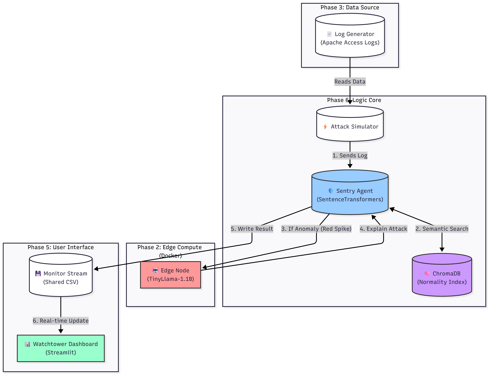
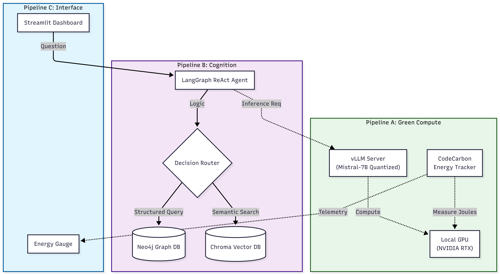
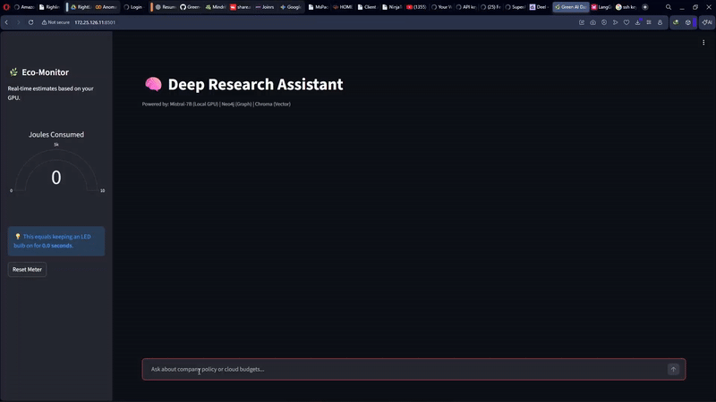

<br>

::::: {.grid}

:::: {.g-col-12 .g-col-lg-8}

## 1. Urban Pulse Engine

<p style="color: var(--text-muted); font-size: 1.1rem; margin-bottom: 1.5rem; margin-top: -0.5rem;">District-Level Traffic Orchestration via Reinforcement Learning</p>

The flagship local orchestration engine. This system scales edge computing from single-node detection to macro-grid control, orchestrating 64 independent traffic lanes across a 20-intersection grid without relying on cloud APIs.

**Architectural Pipeline:**

1. **Digital Twin.** Ingests traffic telemetry and maps it to a deterministic spatial logic layer.
2. **Cognitive Validation.** Utilizes a zero-shot transformer to validate traffic state vectors.
3. **Active Orchestration.** A Proximal Policy Optimization (PPO) Agent actively manages light timings to mitigate terminal gridlock.

::: {.panel-tabset}
### Deployment Telemetry

:::

```{=html}
<div class="d-flex gap-3 flex-wrap mt-3">
  <a href="https://github.com/Najo1on1/Urban-Pulse" target="_blank" class="btn btn-primary btn-sm" style="font-family: var(--font-mono); font-weight: 700; font-size: 0.85rem; padding: 0.5rem 1rem;">[GITHUB]</a>
</div>
```

::::

:::: {.g-col-12 .g-col-lg-4}

```{=html}
<div style="position: sticky; top: 2rem;">
  <div class="sre-terminal">
    <p class="glow-text mb-2" style="font-weight: 700;">SYSTEM_METADATA</p>
    <p><strong>Hardware:</strong> AMD CPU</p>
    <p><strong>DB Anchor:</strong> DuckDB Spatial Extensions</p>
    
    <hr style="border-color: var(--border-subtle); margin: 1rem 0;">
    
    <p class="glow-text mb-2" style="font-weight: 700; color: var(--friction-amber);">FRICTION_LOG: Hardware Bottleneck</p>
    <p style="font-size: 0.85rem; line-height: 1.5; margin-bottom: 0;"><strong>Symptom:</strong> Severe GPU PCIe bus latency crippled RL training speeds.<br>
    <strong>Resolution:</strong> Forcibly routed the PPO Agent off the NVIDIA card and onto the Ryzen 9 CPU, achieving >3,000 FPS throughput.</p>

    <hr style="border-color: var(--border-subtle); margin: 1rem 0;">

    <p class="glow-text mb-2" style="font-weight: 700; color: var(--friction-red);">FRICTION_LOG: Z-Axis Ambiguity</p>
    <p style="font-size: 0.85rem; line-height: 1.5; margin-bottom: 0;"><strong>Symptom:</strong> GPS telemetry overlapped at bridges and tunnels in Lucerne simulations.<br>
    <strong>Resolution:</strong> Engineered a 3D-aware penalty matrix in GeoPandas to force snapping to correct bridge surfaces.</p>
  </div>
</div>
```

::::

:::::

```{=html}
<hr style="border-color: var(--border-subtle); margin: 4rem 0;">
```


## 2. Civic Pulse Monitor (Smart City Ops)

::::: {.grid}

:::: {.g-col-12 .g-col-lg-8}

<p style="color: var(--text-muted); font-size: 1.1rem; margin-bottom: 1.5rem; margin-top: -0.5rem;">Geospatial Graph Intelligence & Local Llama 3</p>

A privacy-first Smart City architecture running entirely offline. Traditional hazard systems treat civic reports as context-blind rows in a database. Civic Pulse gives them a memory.

**The Workflow:**

This system federates structured civic logs with unstructured geospatial data. It utilizes local Llama 3 inference to semantically understand a hazard report, and then strictly validates that hazard against a Neo4j knowledge graph to determine true priority.

::: {.panel-tabset}
### Live Demo

:::

```{=html}
<div class="d-flex gap-3 flex-wrap mt-3">
  <a href="https://github.com/Najo1on1/Cognitive-Engine" target="_blank" class="btn btn-primary btn-sm" style="font-family: var(--font-mono); font-weight: 700; font-size: 0.85rem; padding: 0.5rem 1rem;">[GITHUB]</a>
</div>
```

::::

:::: {.g-col-12 .g-col-lg-4}

```{=html}
<div style="position: sticky; top: 2rem;">
  <div class="sre-terminal">
    <p class="glow-text mb-2" style="font-weight: 700;">METHODOLOGY_BRIDGE</p>
    <span class="tech-tag" style="background: rgba(139, 92, 246, 0.1); color: var(--accent-violet); border: 1px solid rgba(139, 92, 246, 0.3);">Semantic: Ollama Llama 3</span><br>
    <span style="color: var(--text-muted); margin-left: 1rem;">↓ Strictly Anchored By ↓</span><br>
    <span class="tech-tag mt-1" style="background: rgba(0, 229, 255, 0.1); color: var(--accent-cyan); border: 1px solid rgba(0, 229, 255, 0.3);">Symbolic: Neo4j Graph DB</span>
    
    <hr style="border-color: var(--border-subtle); margin: 1rem 0;">
    
    <p class="glow-text mb-2" style="font-weight: 700; color: var(--friction-amber);">INFRASTRUCTURE_LOG</p>
    <p style="font-size: 0.85rem; line-height: 1.5; margin-bottom: 0;"><strong>Design Decision:</strong> Operating entirely offline ensures sensitive civic and geospatial hazard data never leaves the edge node, achieving 100% data sovereignty.</p>
  </div>
</div>
```

::::

:::::

```{=html}
<hr style="border-color: var(--border-subtle); margin: 4rem 0;">
```


## 3. Eco Sentry: Cognitive Edge Security

::::: {.grid}

:::: {.g-col-12 .g-col-lg-8}

<p style="color: var(--text-muted); font-size: 1.1rem; margin-bottom: 1.5rem; margin-top: -0.5rem;">The Air-Gapped Cognitive Firewall</p>

Traditional rule-based firewalls are too rigid for modern IoT networks, and sending logs to Cloud SIEMs incurs massive latency and cost. 

**The Solution:**

A local Vector Database (ChromaDB) acts as the memory core, continuously learning traffic baseline patterns. When an anomaly is detected, instead of just blocking it, a local TinyLlama agent analyzes the vector distance to explain *why* the packet is anomalous in plain English.

::: {.panel-tabset}
### System Architecture


### Live Demo

:::

```{=html}
<div class="d-flex gap-3 flex-wrap mt-3">
  <a href="https://github.com/Najo1on1/Eco-Sentry-Integrated-Edge-AI-Security-Pipeline" target="_blank" class="btn btn-primary btn-sm" style="font-family: var(--font-mono); font-weight: 700; font-size: 0.85rem; padding: 0.5rem 1rem;">[GITHUB]</a>
</div>
```

::::

:::: {.g-col-12 .g-col-lg-4}

```{=html}
<div style="position: sticky; top: 2rem;">
  <div class="sre-terminal">
    <p class="glow-text mb-2" style="font-weight: 700;">METHODOLOGY_BRIDGE</p>
    <span class="tech-tag" style="background: rgba(139, 92, 246, 0.1); color: var(--accent-violet); border: 1px solid rgba(139, 92, 246, 0.3);">Semantic: TinyLlama 1.1B</span><br>
    <span style="color: var(--text-muted); margin-left: 1rem;">↓ Strictly Anchored By ↓</span><br>
    <span class="tech-tag mt-1" style="background: rgba(0, 229, 255, 0.1); color: var(--accent-cyan); border: 1px solid rgba(0, 229, 255, 0.3);">Symbolic: ChromaDB Vector Space</span>
    
    <hr style="border-color: var(--border-subtle); margin: 1rem 0;">
    
    <p class="glow-text mb-2" style="font-weight: 700; color: var(--friction-red);">FRICTION_LOG: Hardware Limits</p>
    <p style="font-size: 0.85rem; line-height: 1.5; margin-bottom: 0;"><strong>Constraint:</strong> IoT edge nodes possess highly constrained memory overhead.<br>
    <strong>Resolution:</strong> Utilizing TinyLlama ensures the semantic reasoning engine operates securely within fractional VRAM footprints, allowing ChromaDB to hold priority.</p>
  </div>
</div>
```

::::

:::::

```{=html}
<hr style="border-color: var(--border-subtle); margin: 4rem 0;">
```


## 4. Green-AI Cognitive Pipeline

::::: {.grid}

:::: {.g-col-12 .g-col-lg-8}

<p style="color: var(--text-muted); font-size: 1.1rem; margin-bottom: 1.5rem; margin-top: -0.5rem;">Carbon-Aware Local Agentic Routing</p>

The true cost of Generative AI is power consumption. This architecture replaces heavy cloud APIs with quantized local models to drastically reduce carbon footprint while maintaining strict data privacy.

**Key Innovation:**

A "Real-Time Energy Router" that physically measures the exact Joules consumed per generated token. The ReAct Agent intelligently switches between Graph (Structured) and Vector (Unstructured) memory depending on the query to optimize compute cycles.

::: {.panel-tabset}
### System Architecture


### Live Demo

:::

```{=html}
<div class="d-flex gap-3 flex-wrap mt-3">
  <a href="https://github.com/Najo1on1/Green-AI-Pipeline" target="_blank" class="btn btn-primary btn-sm" style="font-family: var(--font-mono); font-weight: 700; font-size: 0.85rem; padding: 0.5rem 1rem;">[GITHUB]</a>
</div>
```

::::

:::: {.g-col-12 .g-col-lg-4}

```{=html}
<div style="position: sticky; top: 2rem;">
  <div class="sre-terminal">
    <p class="glow-text mb-2" style="font-weight: 700;">SYSTEM_METADATA</p>
    <p><strong>Primary Model:</strong> Local LLM (Mistral)</p>
    <p><strong>Orchestration:</strong> LangGraph Agent</p>
    
    <hr style="border-color: var(--border-subtle); margin: 1rem 0;">
    
    <p class="glow-text mb-2" style="font-weight: 700; color: var(--friction-amber);">TELEMETRY_OBSERVATION</p>
    <p style="font-size: 0.85rem; line-height: 1.5; margin-bottom: 0;"><strong>Optimization:</strong> By monitoring the hardware's power draw at the thread level, the LangGraph supervisor can terminate reasoning loops that exceed the mathematical Joules-per-token threshold.</p>
  </div>
</div>
```

::::

:::::


```{=html}
<div style="display: flex; justify-content: space-between; align-items: center; margin-top: 4rem; margin-bottom: 2rem;">
  <a href="index.html" class="btn btn-outline-secondary" style="font-weight: 700; padding: 0.75rem 1.5rem; font-family: var(--font-mono); border-color: var(--border-subtle) !important; color: var(--text-muted) !important;">&larr; BACK HOME</a>
  <a href="02_cloud.html" class="btn btn-primary" style="font-weight: 700; padding: 0.75rem 1.5rem; font-family: var(--font-mono);">NEXT CLOUD SYSTEMS &rarr;</a>
</div>