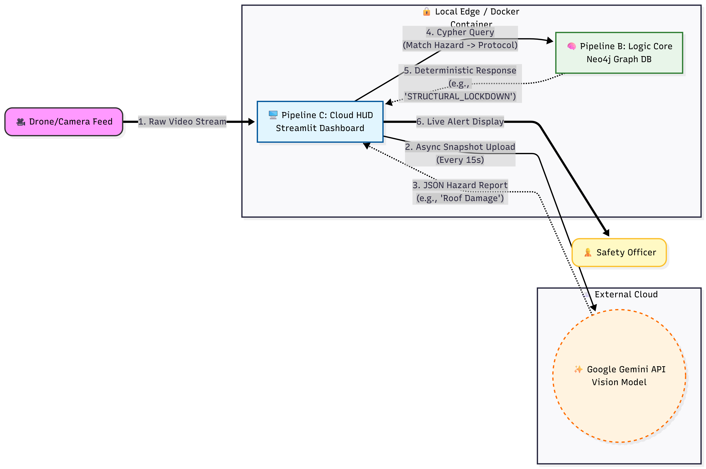
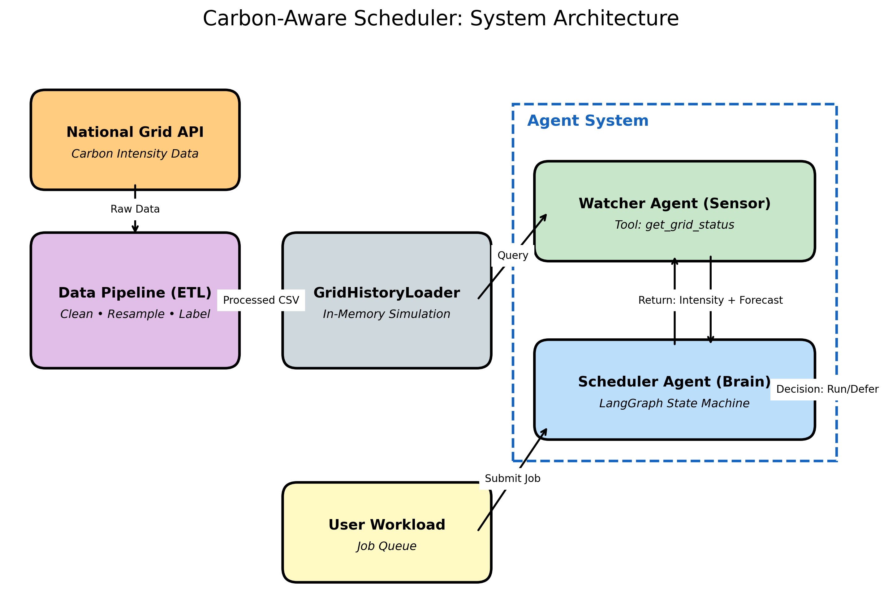
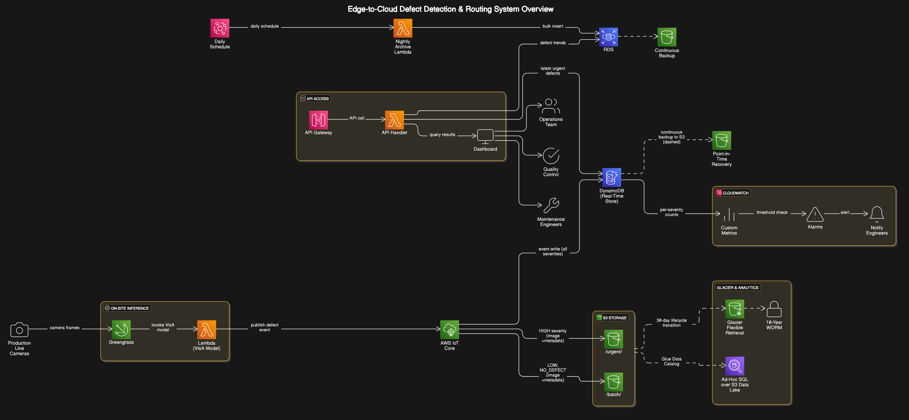

<br>

## 1. Eco Sentry: Cloud Hybrid Route

::::: {.grid}

:::: {.g-col-12 .g-col-lg-8}

<p style="color: var(--text-muted); font-size: 1.1rem; margin-bottom: 1.5rem; margin-top: -0.5rem;">The "Satellite Command" unit bridging Infinite Context with Deterministic Logic</p>

Traditional vision systems suffer from context blindness, while Generative AI is prone to catastrophic hallucination when making industrial safety decisions. This architecture solves both by hybridizing cloud-scale LLMs with strict graph databases.

**Architectural Pipeline:**

1. **Vision Proxy.** Captures frames and handles API rate limiting, asynchronously uploading feed data to Google Gemini.
2. **Logic Core.** Enforces deterministic safety policies using Neo4j and Cypher. It normalizes AI inputs to static hazard nodes and maps them instantly to safety protocols.
3. **Cloud HUD.** A Streamlit dashboard bridging real-time local video with asynchronous cloud intelligence updates.

::: {.panel-tabset}
### System Architecture


### Live Demo

:::

```{=html}
<div class="d-flex gap-3 flex-wrap mt-3">
  <a href="https://github.com/Najo1on1/Cloud-Hybrid-Eco-Sentry" target="_blank" class="btn btn-primary btn-sm" style="font-family: var(--font-mono); font-weight: 700; font-size: 0.85rem; padding: 0.5rem 1rem;">[GITHUB]</a>
</div>
```

::::

:::: {.g-col-12 .g-col-lg-4}

```{=html}
<div style="position: sticky; top: 2rem;">
  <div class="sre-terminal">
    <p class="glow-text mb-2" style="font-weight: 700;">SYSTEM_METADATA</p>
    <p><strong>Multimodal AI:</strong> Google Gemini API</p>
    <p><strong>Graph Engine:</strong> Neo4j / Cypher</p>
    
    <hr style="border-color: var(--border-subtle); margin: 1rem 0;">

    <p class="glow-text mb-2" style="font-weight: 700;">METHODOLOGY_BRIDGE</p>
    <span class="tech-tag" style="background: rgba(139, 92, 246, 0.1); color: var(--accent-violet); border: 1px solid rgba(139, 92, 246, 0.3);">Semantic: Gemini (Observation)</span><br>
    <span style="color: var(--text-muted); margin-left: 1rem;">↓ Strictly Anchored By ↓</span><br>
    <span class="tech-tag mt-1" style="background: rgba(0, 229, 255, 0.1); color: var(--accent-cyan); border: 1px solid rgba(0, 229, 255, 0.3);">Symbolic: Neo4j (Action)</span>
    
    <hr style="border-color: var(--border-subtle); margin: 1rem 0;">
    
    <p class="glow-text mb-2" style="font-weight: 700; color: var(--friction-amber);">FRICTION_LOG: Video Freezing</p>
    <p style="font-size: 0.85rem; line-height: 1.5; margin-bottom: 0;"><strong>Symptom:</strong> Synchronous API calls to Gemini blocked the main thread, freezing the security feed.<br>
    <strong>Resolution:</strong> Engineered an asynchronous "Pulse" architecture, decoupling the video feed from the intelligence loop to manage latency and API costs simultaneously.</p>
  </div>
</div>
```

::::

:::::

```{=html}
<hr style="border-color: var(--border-subtle); margin: 4rem 0;">
```


## 2. Carbon-Aware Agentic Scheduler

::::: {.grid}

:::: {.g-col-12 .g-col-lg-8}

<p style="color: var(--text-muted); font-size: 1.1rem; margin-bottom: 1.5rem; margin-top: -0.5rem;">Multi-Agent Orchestration on AWS Lambda</p>

A distributed system that schedules and executes heavy AI training jobs dynamically based on the real-time carbon intensity of the electricity grid, utilizing serverless architecture to scale down to zero when idle.

**Architectural Pipeline:**

1. **Grid Telemetry.** Ingests live carbon intensity API data to monitor regional power grids.
2. **LangGraph Orchestration.** A multi-agent supervisor evaluates grid thresholds and determines optimal routing execution paths.
3. **Payload Execution.** Triggers containerized workloads via AWS Lambda once environmental and cost parameters are met.

::: {.panel-tabset}
### System Architecture

:::

```{=html}
<div class="d-flex gap-3 flex-wrap mt-3">
  <a href="https://github.com/Najo1on1/carbon-aware-scheduler" target="_blank" class="btn btn-primary btn-sm" style="font-family: var(--font-mono); font-weight: 700; font-size: 0.85rem; padding: 0.5rem 1rem;">[GITHUB]</a>
</div>
```

::::

:::: {.g-col-12 .g-col-lg-4}

```{=html}
<div style="position: sticky; top: 2rem;">
  <div class="sre-terminal">
    <p class="glow-text mb-2" style="font-weight: 700;">SYSTEM_METADATA</p>
    <p><strong>Compute Core:</strong> AWS Lambda</p>
    <p><strong>Orchestration:</strong> LangGraph Multi-Agent</p>
    
    <hr style="border-color: var(--border-subtle); margin: 1rem 0;">
    
    <p class="glow-text mb-2" style="font-weight: 700; color: var(--friction-amber);">INFRASTRUCTURE_LOG</p>
    <p style="font-size: 0.85rem; line-height: 1.5; margin-bottom: 0;"><strong>Design Decision:</strong> Utilizing AWS Lambda for the executor agents ensures that the orchestration infrastructure itself does not contribute baseline idle emissions while waiting for the grid to "turn green."</p>
  </div>
</div>
```

::::

:::::

```{=html}
<hr style="border-color: var(--border-subtle); margin: 4rem 0;">
```


## 3. Serverless AI Pipeline

::::: {.grid}

:::: {.g-col-12 .g-col-lg-8}

<p style="color: var(--text-muted); font-size: 1.1rem; margin-bottom: 1.5rem; margin-top: -0.5rem;">Sub-100ms Quality Inspection on AWS IoT Core</p>

An enterprise-grade computer vision pipeline designed for high-throughput manufacturing. It bridges factory floor hardware with scalable cloud inference.

**Architectural Pipeline:**

1. **Edge Ingestion.** Factory floor cameras stream localized defect data via MQTT protocols to AWS IoT Core.
2. **Serverless Inference.** AWS Lambda triggers a containerized PyTorch model to run bounding-box inference on incoming payloads.
3. **Quality Routing.** Results are logged into DynamoDB, triggering downstream mechanical sorting alerts.

::: {.panel-tabset}
### System Architecture

:::

```{=html}
<div class="d-flex gap-3 flex-wrap mt-3">
  <a href="https://github.com/Najo1on1/Serverless-AI-Pipeline-for-High-Throughput-Quality-Inspection-on-AWS" target="_blank" class="btn btn-primary btn-sm" style="font-family: var(--font-mono); font-weight: 700; font-size: 0.85rem; padding: 0.5rem 1rem;">[GITHUB]</a>
</div>
```

::::

:::: {.g-col-12 .g-col-lg-4}

```{=html}
<div style="position: sticky; top: 2rem;">
  <div class="sre-terminal">
    <p class="glow-text mb-2" style="font-weight: 700;">SYSTEM_METADATA</p>
    <p><strong>Data Pipeline:</strong> AWS Greengrass & IoT Core</p>
    <p><strong>Inference Engine:</strong> PyTorch</p>
    
    <hr style="border-color: var(--border-subtle); margin: 1rem 0;">
    
    <p class="glow-text mb-2" style="font-weight: 700; color: var(--friction-red);">FRICTION_LOG: Cold Start Latency</p>
    <p style="font-size: 0.85rem; line-height: 1.5; margin-bottom: 0;"><strong>Symptom:</strong> Initial invocations of the PyTorch Lambda function suffered multi-second cold starts, violating the sub-100ms SLA for the assembly line.<br>
    <strong>Resolution:</strong> Packaged the model inside an optimized ECR container image and utilized AWS Provisioned Concurrency to keep inference instances "warm" during active manufacturing shifts.</p>
  </div>
</div>
```

::::

:::::

<br><br>

```{=html}
<div style="display: flex; justify-content: space-between; align-items: center; margin-top: 4rem; margin-bottom: 2rem;">
  <a href="01_edge.html" class="btn btn-outline-secondary" style="font-weight: 700; padding: 0.75rem 1.5rem; font-family: var(--font-mono); border-color: var(--border-subtle) !important; color: var(--text-muted) !important;">&larr; BACK TO EDGE NODES</a>
  <a href="03_data.html" class="btn btn-primary" style="font-weight: 700; padding: 0.75rem 1.5rem; font-family: var(--font-mono);">NEXT DATA PIPELINES &rarr;</a>
</div>