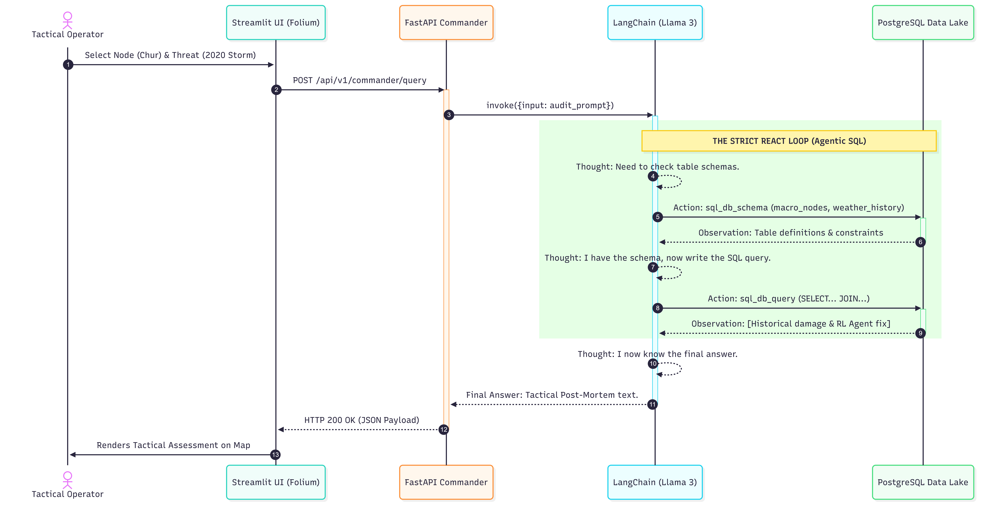
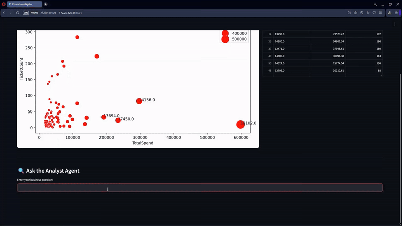
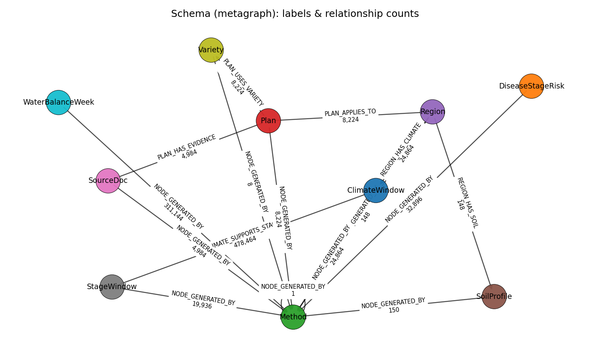
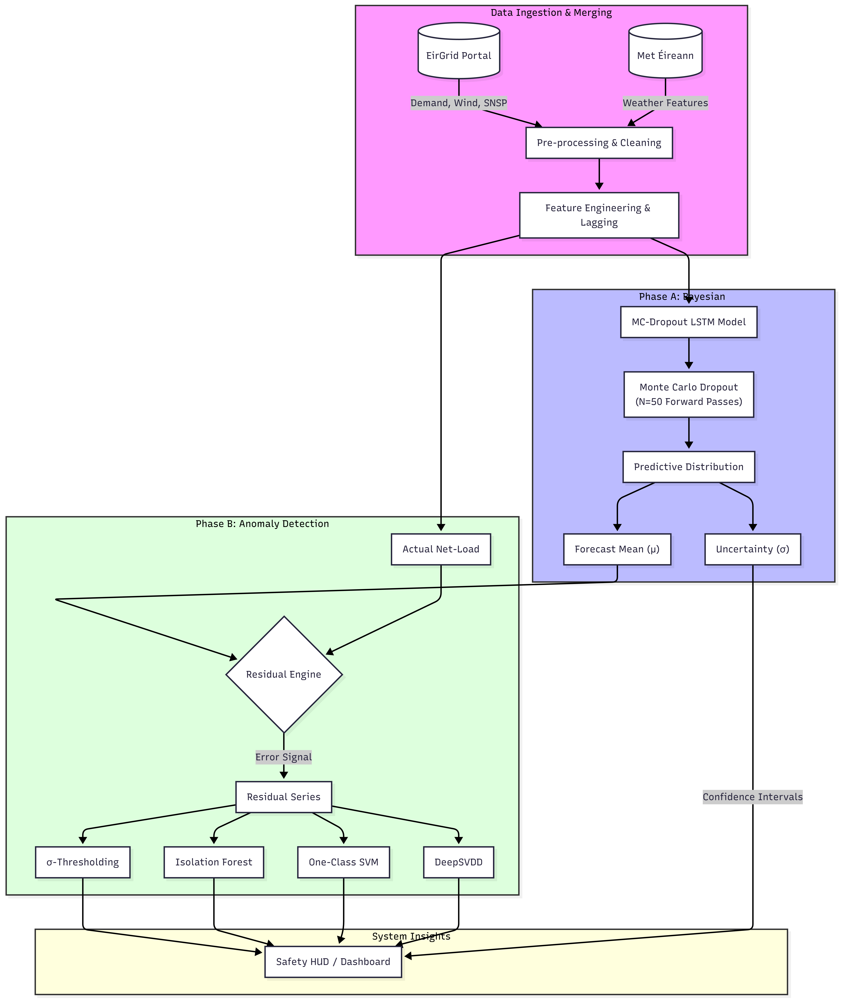

<br>

## 1. Lex-Ghost Architect: Enterprise Resilience

::::: {.grid}

:::: {.g-col-12 .g-col-lg-8}

<p style="color: var(--text-muted); font-size: 1.1rem; margin-bottom: 1.5rem; margin-top: -0.5rem;">Simulating Infrastructure Threats with Generative AI and Agentic RAG</p>

An end-to-end enterprise resilience platform. This system simulates physical infrastructure damage and orchestrates recovery strategies, empowering decision-makers through an air-gapped "War Room" interface.

**Architectural Pipeline:**

1. **Disaster Data Lake (ETL).** Prioritizes the "EU Data Bridge" to ingest, clean, and mathematically verify "Ground Truth" disaster telemetry.
2. **Threat & Resilience Engines.** Employs Generative Adversarial Networks (GANs) to simulate structural damage, while a PPO Reinforcement Learning agent maps optimal recovery paths.
3. **Resilience Command Center.** An Agentic RAG interface embedded within a Streamlit dashboard allows operators to query and control threat simulations in real-time.

::: {.panel-tabset}
### System Architect

:::

```{=html}
<div class="d-flex gap-3 flex-wrap mt-3">
  <a href="https://github.com/Najo1on1/Lex-Ghost" target="_blank" class="btn btn-primary btn-sm" style="font-family: var(--font-mono); font-weight: 700; font-size: 0.85rem; padding: 0.5rem 1rem;">[GITHUB]</a>
</div>
```

::::

:::: {.g-col-12 .g-col-lg-4}

```{=html}
<div style="position: sticky; top: 2rem;">
  <div class="sre-terminal">
    <p class="glow-text mb-2" style="font-weight: 700;">SYSTEM_METADATA</p>
    <p><strong>Simulation:</strong> GANs + PPO (RL)</p>
    <p><strong>Interface:</strong> Agentic RAG / Streamlit</p>
    
    <hr style="border-color: var(--border-subtle); margin: 1rem 0;">
    
    <p class="glow-text mb-2" style="font-weight: 700; color: var(--friction-red);">FRICTION_LOG: Ground Truth Verification</p>
    <p style="font-size: 0.85rem; line-height: 1.5; margin-bottom: 0;"><strong>Symptom:</strong> Raw disaster feeds contained high noise-to-signal ratios, causing the Generative Threat Engine to hallucinate non-physical damage states.<br>
    <strong>Resolution:</strong> Engineered the EU Data Bridge as a strict ETL gatekeeper, verifying "Ground Truth" telemetry against deterministic geographic bounds before allowing it into the Data Lake.</p>
  </div>
</div>
```

::::

:::::

```{=html}
<hr style="border-color: var(--border-subtle); margin: 4rem 0;">
```


## 2. Churn Investigator: Enterprise Risk Radar

::::: {.grid}

:::: {.g-col-12 .g-col-lg-8}

<p style="color: var(--text-muted); font-size: 1.1rem; margin-bottom: 1.5rem; margin-top: -0.5rem;">Industrial-grade analytics predicting customer churn through friction mapping</p>

A Hybrid Retrieval-Augmented Generation (RAG) architecture that solves the context blindness inherent in standard analytics. By orchestrating queries across millions of rows and a graph database, it pinpoints systemic enterprise risk before it results in customer churn.

**Architectural Pipeline:**

1. **Data Ingestion.** Ingests 1M+ rows of structured customer interaction data into a localized SQLite repository.
2. **Semantic Extraction.** Local Ollama instances process unstructured text logs to extract specific friction events and customer pain points.
3. **Graph Resolution.** Neo4j maps relationships between friction events, predicting systemic churn risk through interconnected nodes.

::: {.panel-tabset}
### Live Demo

:::

```{=html}
<div class="d-flex gap-3 flex-wrap mt-3">
  <a href="https://github.com/Najo1on1/Churn-Investigator" target="_blank" class="btn btn-primary btn-sm" style="font-family: var(--font-mono); font-weight: 700; font-size: 0.85rem; padding: 0.5rem 1rem;">[GITHUB]</a>
</div>
```

::::

:::: {.g-col-12 .g-col-lg-4}

```{=html}
<div style="position: sticky; top: 2rem;">
  <div class="sre-terminal">
    <p class="glow-text mb-2" style="font-weight: 700;">SYSTEM_METADATA</p>
    <p><strong>Orchestration:</strong> LangGraph</p>
    <p><strong>Storage:</strong> SQLite + Neo4j</p>
    
    <hr style="border-color: var(--border-subtle); margin: 1rem 0;">

    <p class="glow-text mb-2" style="font-weight: 700;">METHODOLOGY_BRIDGE</p>
    <span class="tech-tag" style="background: rgba(139, 92, 246, 0.1); color: var(--accent-violet); border: 1px solid rgba(139, 92, 246, 0.3);">Semantic: Ollama (Observation)</span><br>
    <span style="color: var(--text-muted); margin-left: 1rem;">↓ Strictly Anchored By ↓</span><br>
    <span class="tech-tag mt-1" style="background: rgba(0, 229, 255, 0.1); color: var(--accent-cyan); border: 1px solid rgba(0, 229, 255, 0.3);">Symbolic: Neo4j (Decision)</span>
    
    <hr style="border-color: var(--border-subtle); margin: 1rem 0;">
    
    <p class="glow-text mb-2" style="font-weight: 700; color: var(--friction-amber);">FRICTION_LOG: AI Hallucination</p>
    <p style="font-size: 0.85rem; line-height: 1.5; margin-bottom: 0;"><strong>Symptom:</strong> LLMs tasked with predicting churn hallucinated false correlations on large datasets.<br>
    <strong>Resolution:</strong> Stripped the LLM of decision-making power. The AI is restricted entirely to translating unstructured text into nodes; the deterministic Neo4j graph executes the final mathematical risk logic.</p>
  </div>
</div>
```

::::

:::::

```{=html}
<hr style="border-color: var(--border-subtle); margin: 4rem 0;">
```


## 3. EuroAgri Pipeline

::::: {.grid}

:::: {.g-col-12 .g-col-lg-8}

<p style="color: var(--text-muted); font-size: 1.1rem; margin-bottom: 1.5rem; margin-top: -0.5rem;">Semantic Knowledge Graphs for Precision Agriculture</p>

An open-source data backbone processing high-resolution NetCDF climate data and NUTS2 administrative boundaries to generate granular crop-variety recommendations and disease risk models.

**Architectural Pipeline:**

1. **Climate Ingestion.** Extracts and normalizes massive, high-resolution NetCDF spatial files.
2. **Heuristic Imputation.** Calculates missing elemental ground-truth data (NPK) dynamically based on soil texture and organic matter distributions.
3. **Graph Transformation.** Converts tabular Parquet "Source of Truth" files into a semantic Neo4j Knowledge Graph across NUTS2 boundaries.

::: {.panel-tabset}
### Metagraph Schema

:::

```{=html}
<div class="d-flex gap-3 flex-wrap mt-3">
  <a href="https://github.com/Najo1on1/euroagri-pipeline" target="_blank" class="btn btn-primary btn-sm" style="font-family: var(--font-mono); font-weight: 700; font-size: 0.85rem; padding: 0.5rem 1rem;">[GITHUB]</a>
</div>
```

::::

:::: {.g-col-12 .g-col-lg-4}

```{=html}
<div style="position: sticky; top: 2rem;">
  <div class="sre-terminal">
    <p class="glow-text mb-2" style="font-weight: 700;">SYSTEM_METADATA</p>
    <p><strong>Processing:</strong> Pandas / NetCDF</p>
    <p><strong>Physics Anchor:</strong> FAO-56 Penman-Monteith</p>
    
    <hr style="border-color: var(--border-subtle); margin: 1rem 0;">
    
    <p class="glow-text mb-2" style="font-weight: 700; color: var(--friction-red);">FRICTION_LOG: Missing Data</p>
    <p style="font-size: 0.85rem; line-height: 1.5; margin-bottom: 0;"><strong>Symptom:</strong> Global datasets severely lacked direct Nitrogen, Phosphorus, and Potassium (NPK) field data.<br>
    <strong>Resolution:</strong> Engineered a transparent Heuristic Imputation Engine (NPK v01) to estimate critical elemental levels from surrounding soil physics, unlocking the ability to generate granular crop recommendations.</p>
  </div>
</div>
```

::::

:::::

```{=html}
<hr style="border-color: var(--border-subtle); margin: 4rem 0;">
```


## 4. Net-Load Forecasting (Master's Dissertation)

::::: {.grid}

:::: {.g-col-12 .g-col-lg-8}

<p style="color: var(--text-muted); font-size: 1.1rem; margin-bottom: 1.5rem; margin-top: -0.5rem;">Calibrated Uncertainty & Residual-Based Anomaly Detection for the Irish Power System</p>

Investigated the intersection of probabilistic deep learning and out-of-distribution detection to solve the "context blindness" of traditional energy forecasting during rapid Atlantic weather shifts. Processed 10 years of SCADA operational logs and minute-level Met Éireann meteorological feeds.

**Architectural Pipeline:**

1. **Index Regularization.** Built a strict 15-minute chronological spine, deterministically resolving duplicate timestamps and daylight-saving time (DST) shifts.
2. **Probabilistic Forecasting.** Replaced classical ARIMA-GARCH models with an MC-Dropout LSTM, producing both point-forecasts and calibrated 80%/95% uncertainty bands.
3. **Residual Detection.** Utilized DeepSVDD and One-Class SVMs to flag structural grid anomalies based on the model's forecast *residuals*, rather than the raw net-load.

::: {.panel-tabset}
### System Architecture

:::

```{=html}
<div class="d-flex gap-3 flex-wrap mt-3">
  <a href="https://github.com/Najo1on1/Useful-AI-in-Irish-Power-System" target="_blank" class="btn btn-primary btn-sm" style="font-family: var(--font-mono); font-weight: 700; font-size: 0.85rem; padding: 0.5rem 1rem;">[GITHUB]</a>
  <a href="files/Dissertation 21189676 Muwanguzi Jonathan.pdf" target="_blank" class="btn btn-info btn-sm" style="font-family: var(--font-mono); font-weight: 700; font-size: 0.85rem; padding: 0.5rem 1rem;">[DOWNLOAD_DISSERTATION]</a>
</div>
```

::::

:::: {.g-col-12 .g-col-lg-4}

```{=html}
<div style="position: sticky; top: 2rem;">
  <div class="sre-terminal">
    <p class="glow-text mb-2" style="font-weight: 700;">SYSTEM_METADATA</p>
    <p><strong>Forecasting:</strong> MC-Dropout LSTM</p>
    <p><strong>Anomaly Detection:</strong> DeepSVDD / OC-SVM</p>
    
    <hr style="border-color: var(--border-subtle); margin: 1rem 0;">
    
    <p class="glow-text mb-2" style="font-weight: 700; color: var(--friction-amber);">FRICTION_LOG: Feature Overfitting</p>
    <p style="font-size: 0.85rem; line-height: 1.5; margin-bottom: 0;"><strong>Symptom:</strong> Initial recurrent models trained on 187 exogenous features generalized poorly, achieving test RMSEs >1 GW.<br>
    <strong>Resolution:</strong> Constructed a three-way wrapper/filter pipeline (Mutual Information + XGBoost + RFE) to compress the space to a 15-feature compact core, dropping RMSE to ~248 MW.</p>

    <hr style="border-color: var(--border-subtle); margin: 1rem 0;">

    <p class="glow-text mb-2" style="font-weight: 700; color: var(--friction-red);">INFRASTRUCTURE_LOG: Temporal Leakage</p>
    <p style="font-size: 0.85rem; line-height: 1.5; margin-bottom: 0;"><strong>Constraint:</strong> Standard K-Fold Cross-Validation leaks future data and smears rare grid events.<br>
    <strong>Resolution:</strong> Engineered a custom, rolling-origin Anomaly-Safe Splitter to enforce temporal integrity and guarantee minimum rare-event densities per validation block.</p>
  </div>
</div>
```

::::

:::::

<br><br>

```{=html}
<div style="display: flex; justify-content: space-between; align-items: center; margin-top: 4rem; margin-bottom: 2rem;">
  <a href="02_cloud.html" class="btn btn-outline-secondary" style="font-weight: 700; padding: 0.75rem 1.5rem; font-family: var(--font-mono); border-color: var(--border-subtle) !important; color: var(--text-muted) !important;">&larr; BACK TO CLOUD SYSTEMS</a>
  <a href="index.html" class="btn btn-primary" style="font-weight: 700; padding: 0.75rem 1.5rem; font-family: var(--font-mono);">RETURN TO HOME &rarr;</a>
</div>